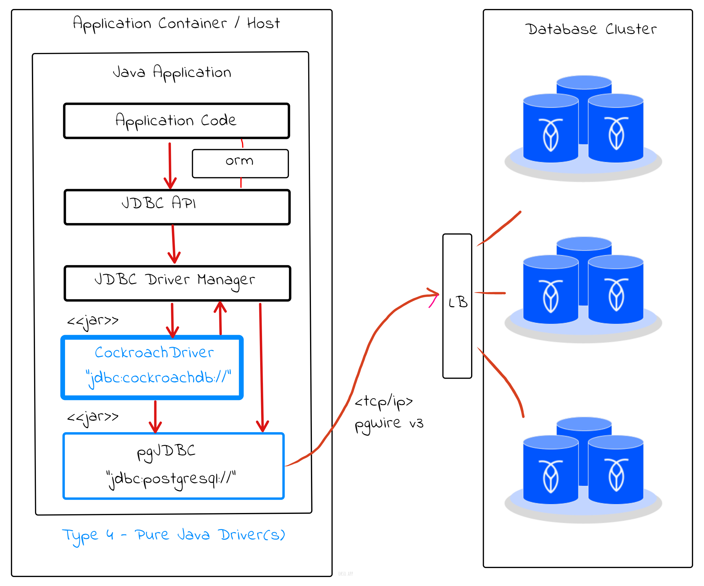
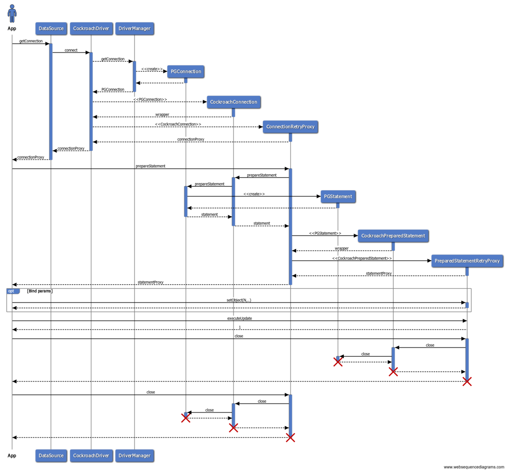
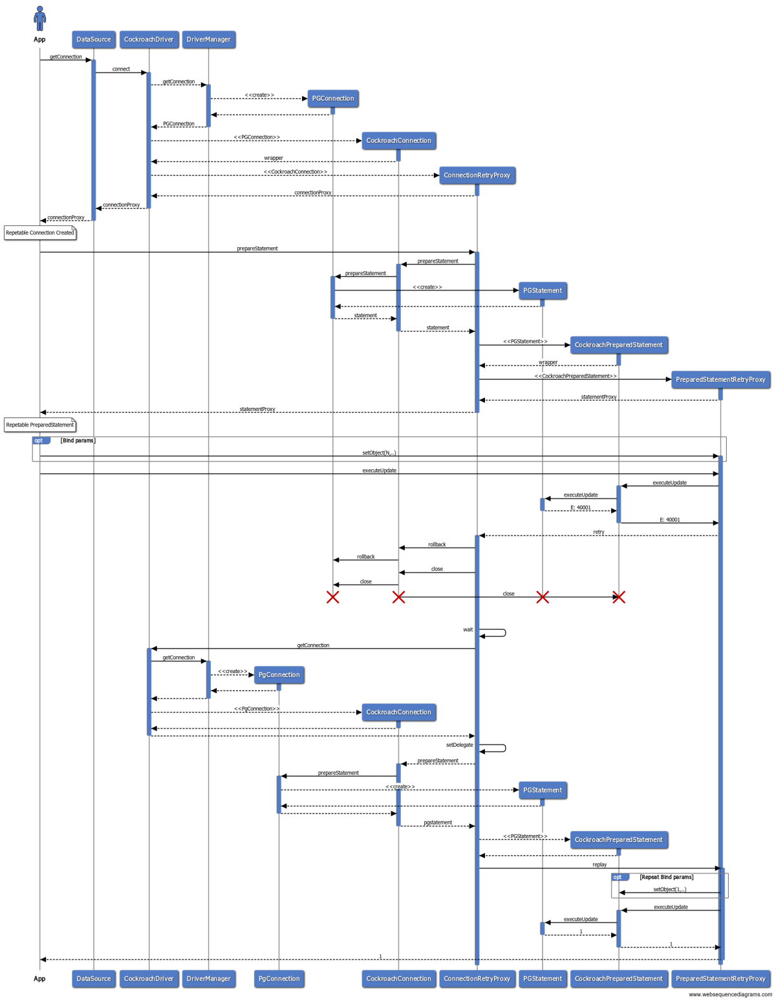

# CockroachDB JDBC Driver Design Notes

This is a JDBC Type-4 driver for [CockroachDB](https://www.cockroachlabs.com/) that wraps the PostgreSQL
JDBC driver ([pgjdbc](https://jdbc.postgresql.org/)) that must be on the app's classpath. 

There are no 
other dependencies besides [SLF4J](https://www.slf4j.org/) for which any supported logging framework 
can be used.

It works by the JDBC Driver accepting a unique jdbc URL prefix `jdbc:cockroachdb` to separate itself 
from `jdbc:postgressql`. When the driver is asked to open a connection (typically by the connection pool), 
it passes the call forward to pgJDBC and then wraps the connection in a CockroachDB connection proxy with
a custom interceptor (invocation handler). The driver delegates all calls to the underlying pgJDBC driver 
and not interact directly with the database itself at any point.

Conceptual diagram:



## Internal Retries

One of driver features is internal retries in contrast to application or client side retries which is 
the other option. It works by the driver wrapping each JDBC connection, statement and result set in a 
dynamic proxy and interceptors capable of detecting and retrying aborted transactions, warranted that 
the SQL exceptions are of a qualified type. The qualifying exception types are of two main categories: 
Serialization Conflicts and Connection Errors.

### Serialization Conflicts

The JDBC driver can (optionally) perform internal© retries of failed transactions due to serialization conflicts
denoted by the `40001` [state code](https://github.com/pgjdbc/pgjdbc/blob/master/pgjdbc/src/main/java/org/postgresql/util/PSQLState.java).

Serialization conflict (40001) errors are safe to retry by the client, or in this case driver. Safe, in 
terms of not producing duplicate side effects since the transaction was rolled back. These errors are 
more likely to manifest in any database running with serializable transaction isolation (1SR), in 
particular for contended workloads subject to read/write and write/read conflicts.

There are some limitations with driver level retries however, see the implementation section below 
for more details.

### Connection Errors

The JDBC driver can (optionally) also perform internal retries on connection errors denoted by any of 
the `08001, 08003, 08004, 08006, 08007, 08S01 or 57P01` [state codes](https://github.com/pgjdbc/pgjdbc/blob/master/pgjdbc/src/main/java/org/postgresql/util/PSQLState.java).

Connection errors during in-flight transactions are generally safe to retry, but there is a potential 
for duplicate side effects if the SQL operations performed are non-idempotent like INSERTs or UPDATEs 
with increment operations (`UPDATE x set y=y-1`). This could happen for example if a transaction commit 
was successful but the response back to the client was lost due to a connection failure. In that case, 
the result is ambiguous and the driver cant tell if the transaction was successfully committed or rolled back.

### Implementation

Transaction conflicts and connection errors can surface at read, write and commit time which means there 
are retry interceptors wrapped around the following JDBC API artifacts:

- `java.sql.Connection`
    - implemented by `CockroachConnection`
    - proxied by `ConnectionRetryInterceptor`, retries on `commit()`
- `java.sql.Statement`
    - implemented by `CockroachStatement`
    - proxied by `StatementRetryInterceptor`, retries on write operations
- `java.sql.PreparedStatement`
    - implemented by `CockroachPreparedStatement`
    - proxied by `PreparedStatementRetryInterceptor`, retries on write operations
- `java.sql.ResultSet`
    - implemented by `CockroachResultSet`
    - proxied by `ResultSetRetryInterceptor`, retries on read operations

Retries are possible by recording most JDBC operations during an explicit transaction (autoCommit set to false). 
If a transaction is aborted due to a transient error it will be rolled back and the connection is closed. 
The recorded operations are then repeated on a new connection delegate while comparing the results against 
the initial transaction attempt. If the results observed by the application client are in any way different 
(determined by SHA-256 checksums), the driver is forced to give up the retry attempt to preserve a 
serializable outcome towards the application, still waiting for completion. 

To illustrate:

```java
try (Connection connection 
        = DriverManager.getConnection("jdbc:cockroachdb://localhost:26257/jdbc_test?sslmode=disable") {
  try (PreparedStatement ps = connection.prepareStatement("update table set x = ? where id = ?")) {
        ps.setObject(1, x);
        ps.setObject(2, y);
        ps.executeUpdate();
  }
}
```

In this ^^ example, assume the `executeUpdate()` method throws a SQLException with state code `40001`. 
This exception is caught by the retry interceptor which will rollback and close the current connection, 
then repeat the recorded operations on a new connection delegate and hope for a different interleaving 
of other concurrent operations that allow for the transaction to complete. 

From the applications perspective, the `executeUpdate()` operation will block until this process is 
either successful or considered futile, in which case a separate SQLException is thrown with the 
same state code.

### Limitations of driver level retries

By contrast, when using application-level retries you would typically need to apply retry logic something 
to the effect of:

```java       
int numCalls=1;
do {
  try {
      // Must begin and commit/rollback transactions
      return businessService.someTransactionBoundaryOperation(); 
  } catch (SQLException sqlException) { // Catch r/w and commit time exceptions
      // 40001 is the only state code we are looking for in terms of safe retries
      if (PSQLState.SERIALIZATION_FAILURE.getState().equals(sqlException.getSQLState())) {
          // handle by logging and waiting with an exponentially increasing delay
      } else {
          throw sqlException; // Some other error, re-throw instantly
      }
  }
} while (numCalls < MAX_RETRY_ATTEMPTS);
```

This type of logic fits well into an [AOP aspect](https://docs.spring.io/spring-framework/docs/current/reference/html/core.html#aop)
with an [around advice](https://docs.spring.io/spring-framework/docs/current/reference/html/core.html#aop-ataspectj-around-advice) 
(or interceptor in JavaEE), weaved in between the caller and transaction boundary (typically a [service facade](https://en.wikipedia.org/wiki/Facade_pattern), 
[service activator](https://www.enterpriseintegrationpatterns.com/MessagingAdapter.html), or web/api controller).   

Application-level retries always have a higher chance of success over driver-level because the application logic
is applied in each repeat cycle. For example, if you are checking for negative account balance in the app-code, 
then it may cancel out additional writes based on the read value when the operation is repeated. Neither the JDBC 
driver or database have any visibility to the application logic, which means that a retry attempt can only succeed 
if all previously observed outcomes are identical to the new ones.

The practical use of driver-level retries is therefore more narrow for common read/write and write/read conflicts,
in which case client-side retries is the preferred approach.
     
## Implicit SELECT FOR UPDATE rewrites

The JDBC driver can optionally append a `FOR UPDATE` clause to qualified SELECT statements. 
A SELECT query qualifies for a rewrite when:

- It's not part of a read-only connection
- There are no aggregate functions
- There are no distinct or GROUP BY operators
- There are no internal CockroachDB schema references

A `SELECT .. FOR UPDATE` will lock the rows returned by a selection query such that other transactions trying to 
access those rows are forced to wait for the transaction that locked the rows to finish. These other transactions 
are effectively put into a queue based on when they tried to read the value of the locked rows. 

Notice that this does not eliminate the chance of serialization conflicts (which can also be due to 
[time uncertainty](https://www.cockroachlabs.com/docs/stable/architecture/transaction-layer.html#transaction-conflicts)) 
but will greatly reduce it. Combined with driver-level retries, this can eliminate the need for app-level 
retry logic for some workloads.

The following example shows a write skew (G2-item) scenario which is prevented by 
CockroachDB serializable isolation:

| T1                                       | T2                                         |
|------------------------------------------|--------------------------------------------|
| begin;                                   | begin;                                     |
| select * from test where id in (1,2);    |                                            |
|                                          | select * from test where id in (1,2);      |
| update test set value = 11 where id = 1; | (reads 10,20)                              |
|                                          | update test set value = 21 where id = 2;   |
| commit;                                  |                                            |
|                                          | commit; --- "ERROR: restart transaction.." |

Running the same sequence with FOR UPDATE:

| T1                                               | T2                                               |
|--------------------------------------------------|--------------------------------------------------|
| begin;                                           | begin;                                           |
| select * from test where id in (1,2) FOR UPDATE; |                                                  |
|                                                  | select * from test where id in (1,2) FOR UPDATE; |
|                                                  | -- blocks on T1                                  |
| update test set value = 11 where id = 1;         |                                                  |
| commit;                                          | -- unblocked, reads 11,20                        |
|                                                  | update test set value = 21 where id = 2;         |
|                                                  | commit;                                          |
                                          
The initial read in T1 will lock the rows and T2 is forced to wait for T1 to finish. When T1 has finished 
with a commit, the read in T2 is reflecting the write of T1 and not that of T2 at the initial read 
timestamp. The T2 read is effectively pushed into the future with the desired effect of these 
operations resulting in a serializable transaction ordering, allowing for both to commit.

## Appendix: Sequence Diagrams

The driver concepts are illustrated with sequence diagrams using [https://www.websequencediagrams.com](https://www.websequencediagrams.com).

### Happy Path 

This diagram illustrates executing a single update with happy outcome, equivalent to:

```java
try (Connection connection 
        = DriverManager.getConnection("jdbc:cockroachdb://localhost:26257/jdbc_test?sslmode=disable") {
  try (PreparedStatement ps = connection.prepareStatement("update table set x = ? where id = ?")) {
        ps.setObject(1, x);
        ps.setObject(2, y);
        ps.executeUpdate();
  }
}
```

(Connection pooling and parameter bindings omitted)

- [Diagram Script](happy-wsd.txt)



### Unhappy Path

This diagram illustrates executing the same single block with an unhappy outcome, equivalent to:

- [Diagram Script](unhappy-wsd.txt)



